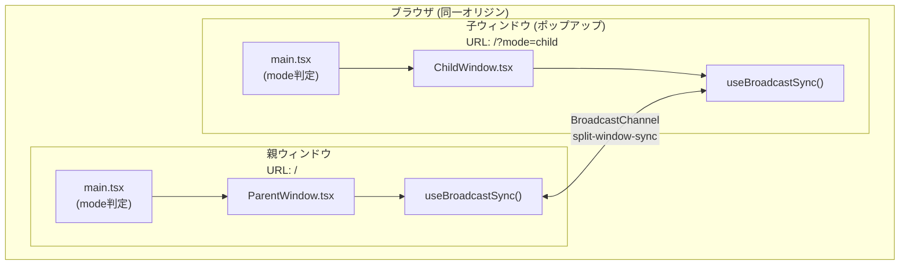
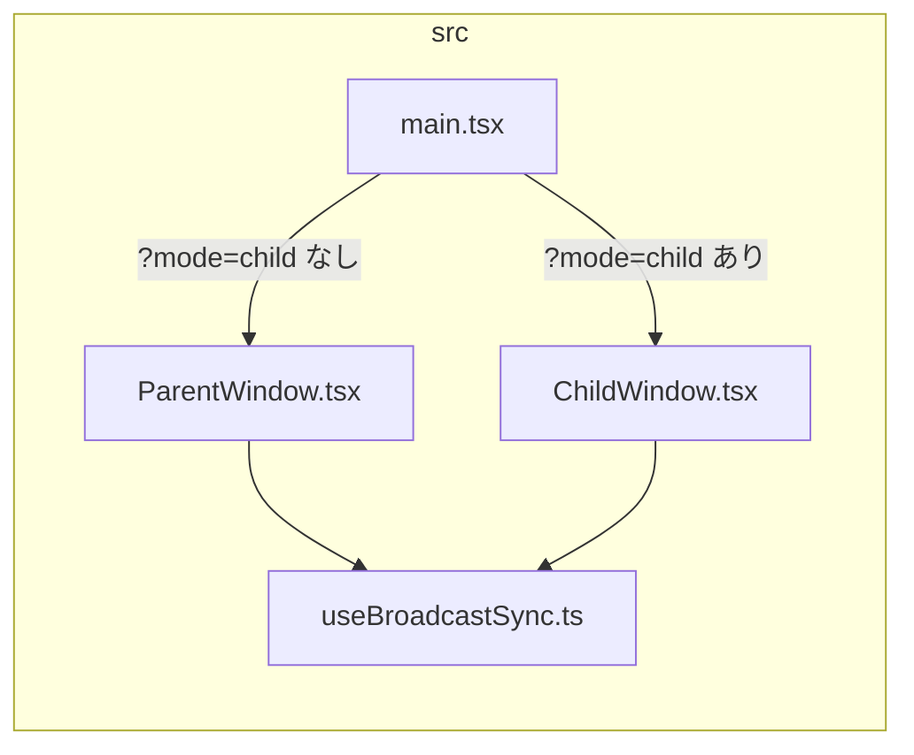
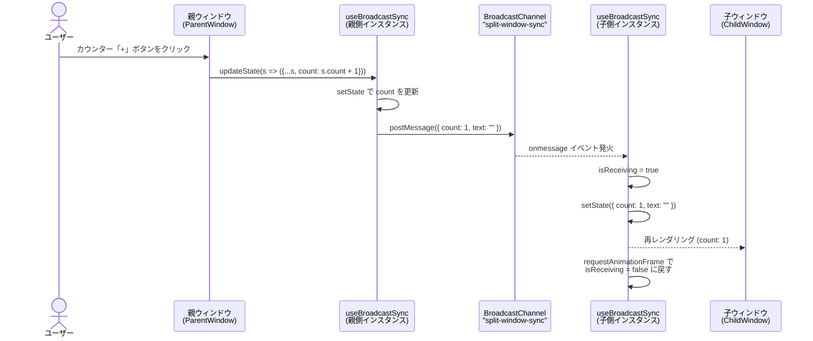
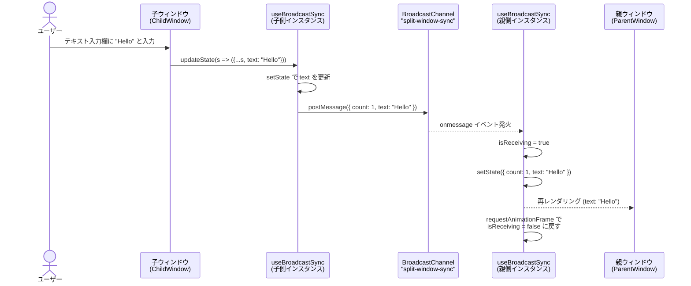
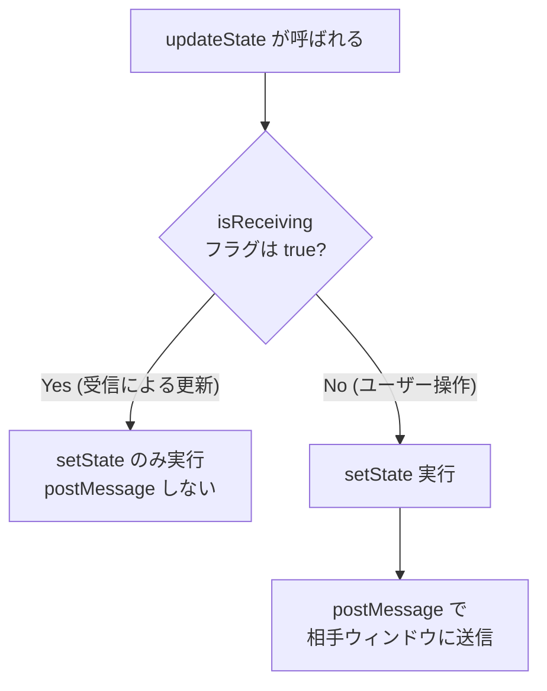
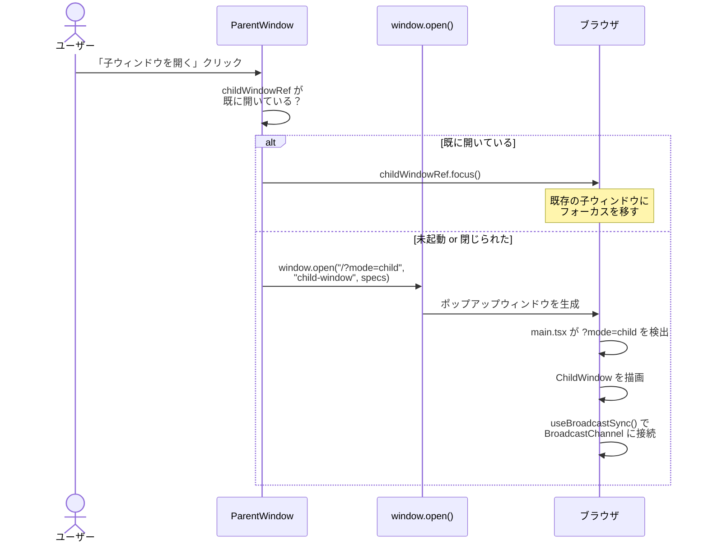
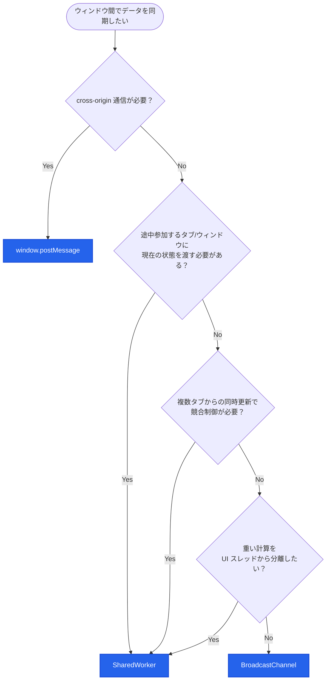

# SplitWindowStudy

React で親ウィンドウからポップアップ（子ウィンドウ）を開き、**BroadcastChannel API** を用いて双方向にデータをリアルタイム同期するサンプルアプリケーションです。

## 起動方法

```bash
npm install
npm run dev
```

ブラウザで表示された URL（例: `http://localhost:5173/`）を開き、「子ウィンドウを開く」ボタンを押してください。

---

## アーキテクチャ概要

### コンポーネント構成図



### ファイル構成と責務



| ファイル | 責務 |
|---|---|
| `main.tsx` | エントリポイント。URL の `?mode=child` パラメータで描画コンポーネントを切り替え |
| `ParentWindow.tsx` | 親画面 UI。`window.open()` で子ウィンドウをポップアップとして起動 |
| `ChildWindow.tsx` | 子画面 UI。親と同じ操作（カウンター・テキスト入力）を提供 |
| `useBroadcastSync.ts` | 双方向同期のカスタムフック。BroadcastChannel による送受信ロジックをカプセル化 |

---

## データ同期の仕組み

### 同期対象のデータ構造

```typescript
interface SyncState {
  count: number;  // カウンター値
  text: string;   // テキスト入力値
}
```

### シーケンス図: 親 → 子の同期



### シーケンス図: 子 → 親の同期



### 再送防止メカニズム

BroadcastChannel は受信側で `setState` を呼ぶと `updateState` 経由で再度 `postMessage` してしまう可能性があります。これを防ぐために `isReceiving` フラグを使用しています。



---

## 子ウィンドウの起動フロー



---

## 技術選定: ウィンドウ間通信 API 比較

| 特性 | BroadcastChannel | window.postMessage | SharedWorker |
|---|---|---|---|
| セットアップの容易さ | 簡単 | やや複雑 | 複雑 |
| 通信方向 | 多対多 | 1対1 | 多対多 |
| ウィンドウ参照の保持 | 不要 | 必要 | 不要 |
| 同一オリジン制約 | あり | なし (cross-origin 可) | あり |
| ブラウザサポート | モダンブラウザ全対応 | 全ブラウザ | モダンブラウザ全対応 |
| 中央集権的な状態管理 | なし（各タブが独自に保持） | なし | Worker が Single Source of Truth を持てる |
| 途中参加タブへの状態提供 | 不可（初期値から開始） | 送信側が参照を持てば可能 | 接続時に現在値を即座に提供 |
| 重い計算のオフロード | 不可（UI スレッドで実行） | 不可（UI スレッドで実行） | 別スレッドで実行可能 |
| 接続中クライアントの把握 | 不可 | 送信側が管理すれば可能 | port で接続・切断を把握可能 |
| 競合・整合性制御 | なし（各タブが自由に更新） | なし | Worker 側で排他制御・バリデーション可能 |

### 選定フローチャート



### 本サンプルでの選定理由

本サンプルでは学習目的でのシンプルさを優先し **BroadcastChannel** を採用しています。

ただし、途中参加タブへの状態提供・競合制御・重い計算のオフロードが必要になった場合は **SharedWorker** への移行を検討してください。
