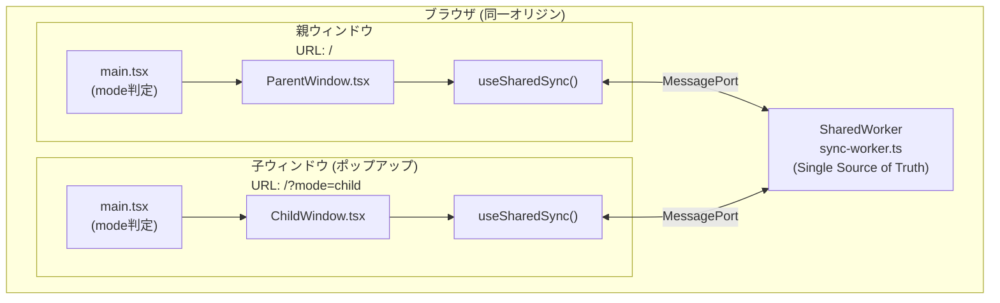
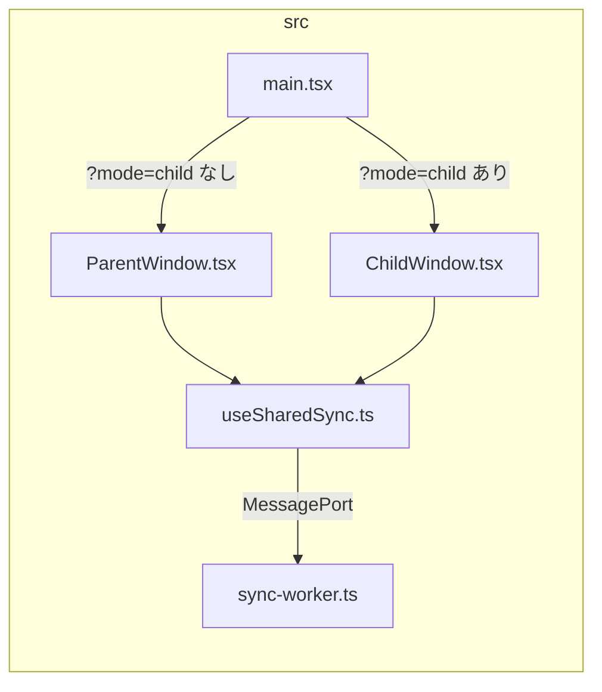
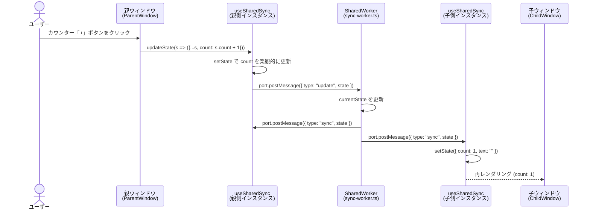
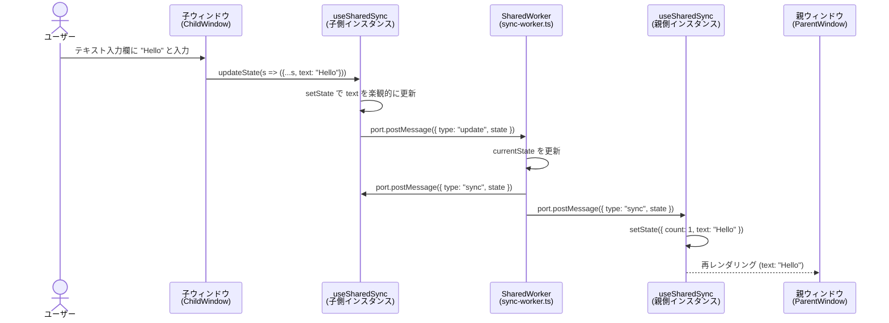
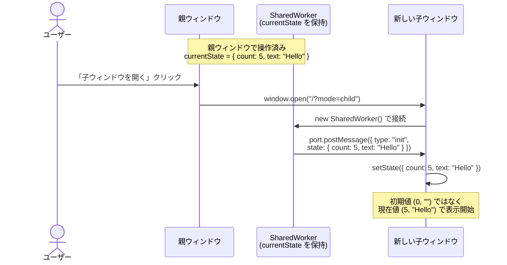
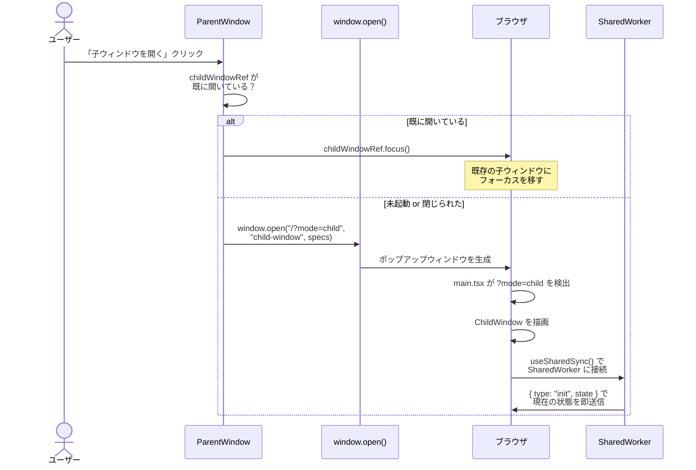
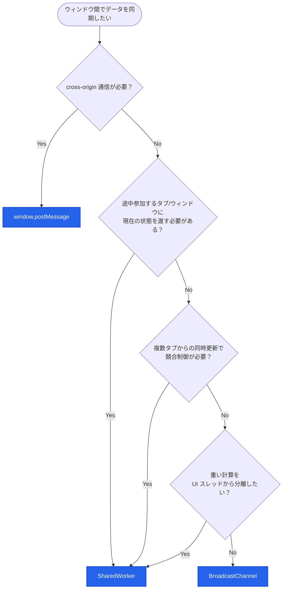

# SplitWindowStudy

React で親ウィンドウからポップアップ（子ウィンドウ）を開き、**SharedWorker** を用いて双方向にデータをリアルタイム同期するサンプルアプリケーションです。SharedWorker が Single Source of Truth として状態を一元管理し、途中参加タブにも現在の状態を即座に提供します。

## 起動方法

```bash
npm install
npm run dev
```

ブラウザで表示された URL（例: `http://localhost:5173/`）を開き、「子ウィンドウを開く」ボタンを押してください。

### 対応ブラウザ

本アプリは `new SharedWorker(..., { type: "module" })` (Module SharedWorker) を使用しています。以下のブラウザが必要です。

| ブラウザ | 最低バージョン |
|---|---|
| Chrome | 80+ |
| Edge | 80+ |
| macOS Safari | 16.0+ |

未対応ブラウザではウィンドウ間同期が無効になり、画面上にその旨が表示されます（クラッシュはしません）。

> **参考:** [MDN SharedWorker](https://developer.mozilla.org/en-US/docs/Web/API/SharedWorker) / [Can I use: SharedWorkers](https://caniuse.com/sharedworkers) / [Can I use: JS modules in shared workers](https://caniuse.com/wf-js-modules-shared-workers)

---

## アーキテクチャ概要

### コンポーネント構成図



### ファイル構成と責務



| ファイル | 責務 |
|---|---|
| `main.tsx` | エントリポイント。URL の `?mode=child` パラメータで描画コンポーネントを切り替え |
| `ParentWindow.tsx` | 親画面 UI。`window.open()` で子ウィンドウをポップアップとして起動 |
| `ChildWindow.tsx` | 子画面 UI。親と同じ操作（カウンター・テキスト入力）を提供 |
| `useSharedSync.ts` | 双方向同期のカスタムフック。SharedWorker への接続・メッセージ送受信をカプセル化 |
| `sync-worker.ts` | SharedWorker スクリプト。状態の一元管理（Single Source of Truth）と全クライアントへのブロードキャストを担当 |

---

## データ同期の仕組み

### 同期対象のデータ構造

```typescript
interface SyncState {
  count: number;  // カウンター値
  text: string;   // テキスト入力値
}
```

### シーケンス図: 親 → 子の同期



### シーケンス図: 子 → 親の同期



### シーケンス図: 途中参加タブの状態取得

SharedWorker の最大の利点 — 後から開いたタブが初期値ではなく現在の状態を即座に取得できます。



---

## 子ウィンドウの起動フロー



---

## 技術選定: ウィンドウ間通信 API 比較

| 特性 | BroadcastChannel | window.postMessage | SharedWorker |
|---|---|---|---|
| セットアップの容易さ | 簡単 | やや複雑 | 複雑 |
| 通信方向 | 多対多 | 1対1 | 多対多 |
| ウィンドウ参照の保持 | 不要 | 必要 | 不要 |
| 同一オリジン制約 | あり | なし (cross-origin 可) | あり |
| ブラウザサポート | モダンブラウザ全対応 | 全ブラウザ | モダンブラウザ全対応 |
| 中央集権的な状態管理 | なし（各タブが独自に保持） | なし | Worker が Single Source of Truth を持てる |
| 途中参加タブへの状態提供 | 不可（初期値から開始） | 送信側が参照を持てば可能 | 接続時に現在値を即座に提供 |
| 重い計算のオフロード | 不可（UI スレッドで実行） | 不可（UI スレッドで実行） | 別スレッドで実行可能 |
| 接続中クライアントの把握 | 不可 | 送信側が管理すれば可能 | port で接続・切断を把握可能 |
| 競合・整合性制御 | なし（各タブが自由に更新） | なし | Worker 側で排他制御・バリデーション可能 |

### 選定フローチャート



### 本サンプルでの選定理由

本サンプルでは **SharedWorker** を採用しています。

- **途中参加タブへの状態提供**: 後から開いたタブが即座に現在の状態を取得でき、BroadcastChannel の「初期値から開始」問題を解決
- **Single Source of Truth**: SharedWorker が唯一の状態管理者となり、各タブ間の状態不整合を防止
- **再送防止ロジック不要**: プロトコル設計により、BroadcastChannel で必要だった `isReceiving` フラグが不要に
